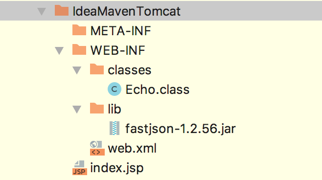
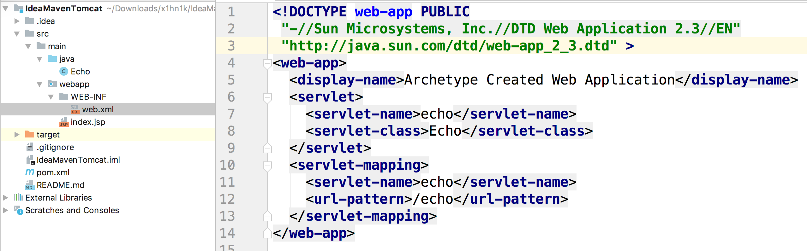

# Java EE — Servlet

市面上关于Java EE开发的教程太多了，但是基本上都是针对零基础或者纯粹的Java程序员。

我是从NodeJS转型JavaEE开发的，我相信我不是最后一个。我踩过很多坑，所以写了这些博客，希望后来者稳一点。

转型过程中最大的问题不是技术本身，当时我对nodejs web开发已经非常熟悉了，主要是设计模式以及思维方式没能及时转变，浪费了很多时间。

#### 阅读之前，你应该

- 能通过Maven + Tomcat + IDEA/Eclipse 搭建基本的Java Web 开发环境
- 简单了解Servelt
- 熟悉HTTP协议
- 用其他语言开发过web程序，最好是NodeJS


#### HTTP 模型

地球上的HTTP服务器都满足一下基本架构

- 接受一个HTTP请求，前置拦截器
- 路由函数
  - 可能要访问数据库，本地磁盘
- 返回一个HTTP响应，后置拦截器


刚刚转型的时候最懵逼的就是Servlet， 这个我也不可能一次说完，慢慢体会这个和nodejs 的区别吧。

我们来看看NodeJS中如何创建一个web服务器:

```js
const http = require('http')

const server = http.createServer((reqest, response) => {
    response.wirte('Hello world')
    response.end()
})

server.listen(8080)
```

我们可以看到这个很经典的请求响应模型，我们的服务端代码主要是集中在对这个处理响应的回调函数进行编写。

但是Java不一样，Java采取了Servlet的技术，和node这种差别还是非常大的。




上面是在Tomcat下配置一个Servlet App的标准目录

- Java EE 没有使用内置web服务器，用户需要自己选择Tomcat，Jetty之类的容器来处理HTTP请求响应
- 要求确定的目录结构：`WEB-INF`是配置目录，`WEB-INF/classes`存放class文件，`WEB-INF/lib`存放依赖的jar包
- 路由信息等参数是在`web.xml`中配置的，而不是编码到代码中


其实我在开始转型的时候，我是很不理解这个问题的。为什么Java Web开发的模式和nodejs是如此的到。从开始的迷茫、不解，到渐入佳境，然后喜欢上了Java EE的开发模式。


#### 外置Web服务器 VS 内置Web服务器

Java EE 开发都是使用外置服务器的，例如Tomcat，而像nodejs python都在标准库中内置了服务器。如何评价这种区别呢？

- 配置起来麻烦了很多
- 可以让语言的标准库(JDK)更加的轻量、底层。
- 后续的更新、扩展更加容易。比如你可以随时deploy、undeploy一个web app而不影响其他的组件。这一点在nodejs中很难，所有的一切都是在代码中耦合在一起的。


其实还有一点因素，那就是Java并发是基于多线程的，如果想像nodejs一样有个`createServer`函数，为了处理并发，代码会非常复杂，使用外置容器的技术很好的让应用程序员快速的开发。


#### 容器能够做什么？

- 通信支持，将TCP报文流解析成HTTP协议，就想node中的http模块一样
- Servlet声明周期管理。之前说过，Servlet的模式和node中的handler函数很不一样，servlet是由生命周期的
- 多线程支持。在node中，因为是异步编程，屏蔽了多线程的复杂度，所以用起来非常简单。但是Java是通过多线程来并发的，web容器帮我们管理线程的创建和维护，降低编码的复制度
- 使用配置文件来管理。我们只要按照既定的格式来写就行了。


#### 配置文件 VS 硬编码

Java EE的路由时写在xml配置文件中的(当然后面的Spring 框架多是用注解，但是原理是一样的)，而nodejs是硬编码的。这一点开始让我很不适应，觉得这样写很麻烦，而且感觉写配置不怎么算是写代码，技术含量有点低。

后来的持续的使用中，我体会到这样的好处。 我们的Servlet只需要知道自己将来会处理请求-响应的行了，不需要关注其他的，代码的耦合度非常高。反观nodejs中的，无论是koa-router还是express，路由和路由函数紧紧的绑定在一起，代码很揉乱，也不利于维护和更新。

至于配置文件和硬编码，能用配置文件写的，都不应该用硬编码！！


#### 路由策略

在nodejs中，路由都是硬编码到代码中，无论是express还是koa-router。但是Java风格确实使用配置文件



其实这在之前是让我有点不适应的，感觉莫名奇妙，以及有点麻烦。 不过现在我是觉得这样写的好一点，就想上一点说的，解耦。每个Servlet只需要知道自己将来会处理请求和响应，至于处理哪一个请求，它并不关心，完全由容器通过配置文件来调用，很舒服。

#### 初始化工程

这个我在其他教程里说过，这里就不多废话了。反正最后生成了上图所示的文件夹

```

```

